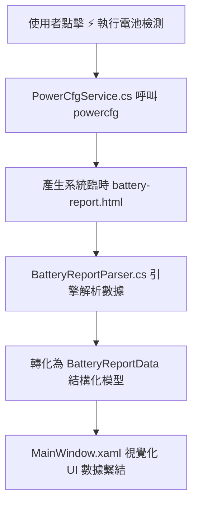

# ⚡ WinBat Lens - Windows 電池健康度分析診斷工具

[](https://dotnet.microsoft.com/)
[](https://www.microsoft.com/windows)
[](https://visualstudio.microsoft.com/)
[](LICENSE)

**WinBat Lens** 是一款基於 C# (.NET 8 WPF) 開發的原生 Windows 桌面應用程式。旨在將 Windows 內建原始指令 `powercfg /batteryreport` 產生的 HTML 報告，轉換為直觀、精美且具備智慧診斷建議的視覺化儀表板。

---

## ✨ 核心特色 (Key Features)

- ⚡ **一鍵自動檢測 (One-Click Battery Audit)**：無須手動開啟 CMD/PowerShell 輸入指令，程式點擊按鈕即可自動呼叫原生 `powercfg /batteryreport` 產生最新報告。
- 🔋 **直覺健康度進度條 (Health Score Ring)**：依據 `(實測滿電容量 / 原廠設計容量) * 100%` 自動計算 health score，並標記狀況等級（良好 / 注意 / 嚴重衰退）。
- 📊 **完整數據規格摘要**：自動解析設計容量 (Design Capacity)、滿電容量 (Full Charge Capacity)、損耗電量 (Wear Loss)、化學材質、製造商與充放電循環次數 (Cycle Count)。
- 📈 **容量歷史與續航估算**：整理電池容量隨時間衰退的歷史數據表與估算續航時間。
- 💡 **智慧保養指南**：自動評估電池損耗率與循環次數，提供專屬的鋰電池保護與充電限制建議。
- 📥 **一鍵資料匯出**：支援將全套解析數據匯出為 JSON 結構化檔案進行備份。
- 📁 **本地 HTML 檔案開啟**：亦支援選擇手動產生的 `battery-report.html` 進行載入與分析。

---

## 🏗️ 系統架構 (Architecture)



---

## 🛠️ 開發環境需求 (Prerequisites)

- **作業系統**：Windows 10 / 11 (64-bit)
- **開發工具**：[Visual Studio 2022](https://visualstudio.microsoft.com/) (須安裝 `.NET 桌面開發` 工作負載)
- **.NET SDK**：[.NET 8.0 SDK](https://dotnet.microsoft.com/download/dotnet/8.0) 或更新版本

---

## 🚀 使用 Visual Studio 編譯與執行 (Build in Visual Studio)

1. **複製專案庫 (Clone Repository)**：
   ```bash
   git clone https://github.com/YOUR_USERNAME/WinBat-Lens.git
   cd WinBat-Lens
   ```

2. **開啟專案檔**：
   - 雙擊開啟 **`WinBatLens.sln`** 方案檔。

3. **建置與執行**：
   - 在 Visual Studio 上方選單確認設定為 `Debug` 或 `Release` 與 `x64` / `Any CPU`。
   - 按下 **`F5`** 鍵（偵錯）或 **`Ctrl + F5`** 鍵（直接執行）。

---

## 💻 命令行建置 (Build via CLI)

您也可以直接使用 .NET CLI 命令進行編譯：

```bash
# 還原並建置專案
dotnet build WinBatLens.csproj -c Release

# 執行專案
dotnet run --project WinBatLens.csproj
```

---

## 📤 如何上傳本專案至 GitHub (Push to GitHub)

若您欲將此專案發布至個人的 GitHub 帳號，請依照以下步驟執行：

```bash
# 1. 在專案根目錄初始化 Git 儲存庫
git init

# 2. 加入所有檔案並進行第一次 Commit
git add .
git commit -m "Initial commit: WinBat Lens C# .NET 8 WPF battery report dashboard"

# 3. 在 GitHub 建立一個新的空 Repository (命名為 WinBat-Lens)
# 4. 關聯遠端儲存庫並推送代碼
git branch -M main
git remote add origin https://github.com/YOUR_USERNAME/WinBat-Lens.git
git push -u origin main
```

---

## 📜 授權條款 (License)

本專案基於 [MIT License](LICENSE) 條款開源發布。
